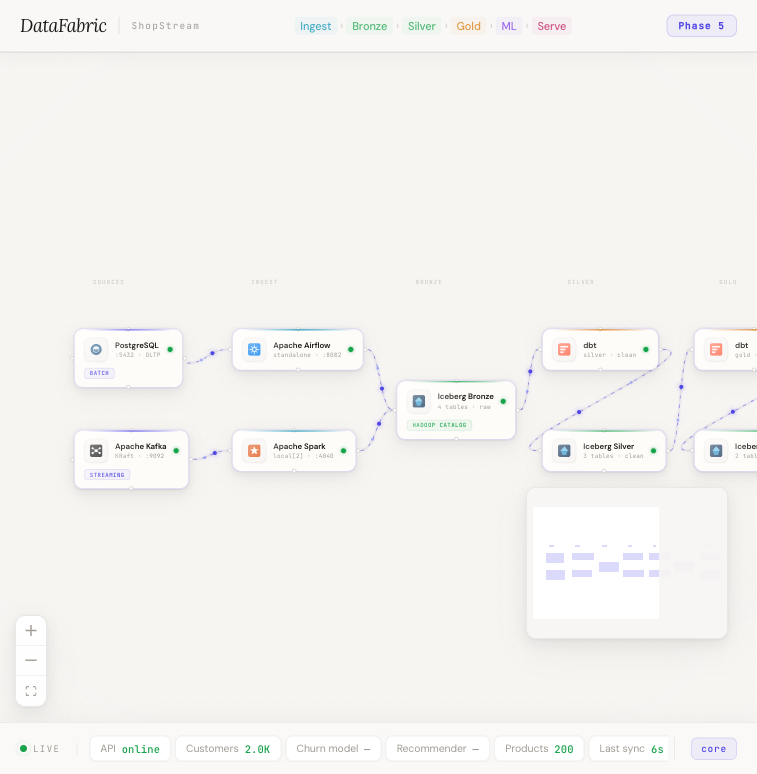
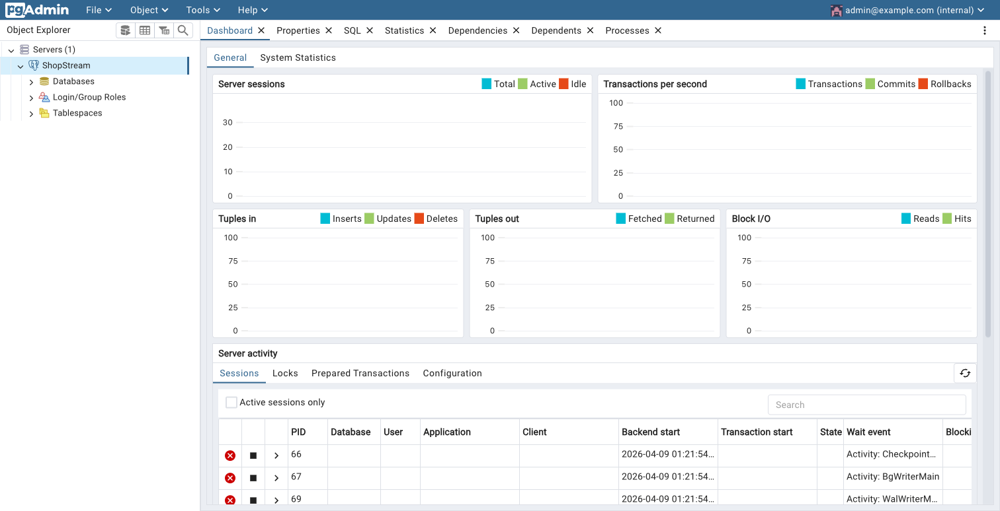
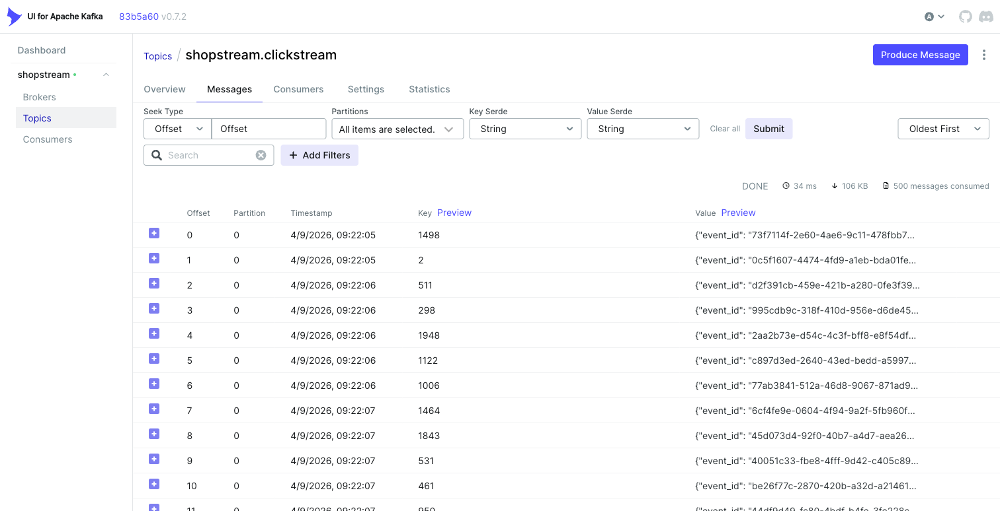
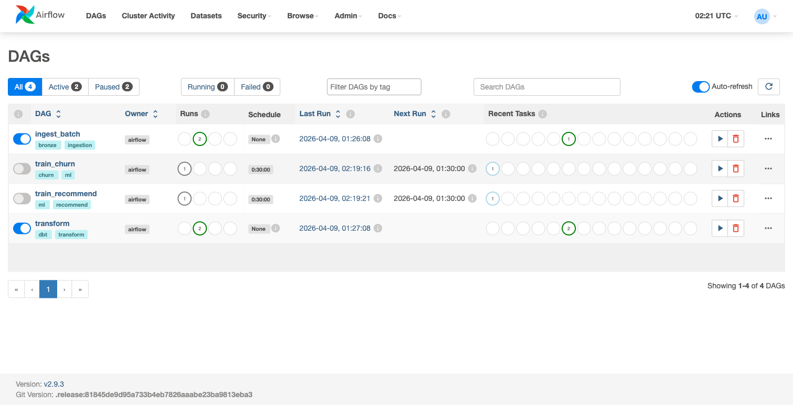
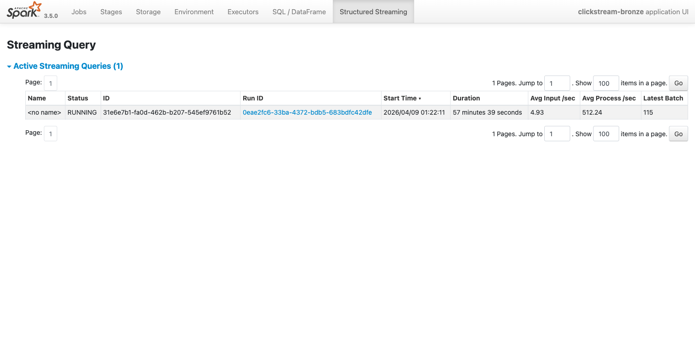
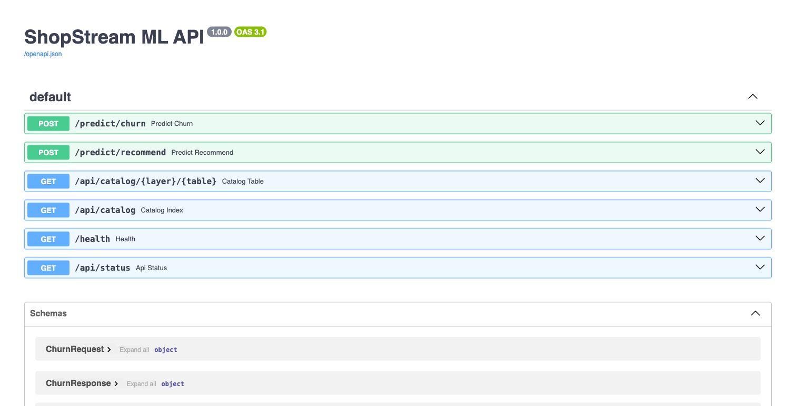

# DataFabric — End-to-End Architecture

**DataFabric** is a full modern data stack built around **ShopStream**, a fictional e-commerce platform. It demonstrates every layer of a real production data platform — from raw event ingestion through a lakehouse, ML training, model serving, and a live lineage UI — all running locally in Docker.

The goal is to answer two business questions from data:
1. **Which customers are about to leave?** (churn prediction)
2. **What should we show each customer next?** (product recommendations)

Everything between raw data and a live API prediction is wired together in this stack.

---

## Data Flow at a Glance

```
┌─────────────┐   batch     ┌─────────────┐
│  PostgreSQL  │ ──────────► │   Airflow   │ ──┐
│  (OLTP)     │   psycopg2  │  (DAG orch) │   │
└─────────────┘             └─────────────┘   │
                                               ▼
                                        ┌────────────┐
                                        │   Iceberg  │
                                        │   Bronze   │  4 tables, raw
                                        └─────┬──────┘
┌─────────────┐  streaming  ┌─────────────┐   │
│    Kafka    │ ──────────► │    Spark    │ ──┘
│  (events)   │  30s micro- │  Streaming  │
└─────────────┘  batches    └─────────────┘
                                               │
                                        ┌──────▼──────┐
                                        │  dbt Silver │  clean + cast
                                        └──────┬──────┘
                                               │
                                        ┌──────▼──────┐
                                        │  dbt Gold   │  ML features
                                        └──────┬──────┘
                                               │
                              ┌────────────────┼────────────────┐
                              ▼                                  ▼
                     ┌──────────────┐                  ┌──────────────────┐
                     │ Churn MLP    │                  │ Product Recomm.  │
                     │ (PyTorch)    │                  │ (Matrix Factori.)│
                     └──────┬───────┘                  └────────┬─────────┘
                            └──────────────┬───────────────────┘
                                           ▼
                                    ┌─────────────┐
                                    │   MLflow    │  experiment tracking
                                    │  Registry   │  + model versioning
                                    └──────┬──────┘
                                           ▼
                                    ┌─────────────┐
                                    │   FastAPI   │  /predict/churn
                                    │    :8001    │  /predict/recommend
                                    └──────┬──────┘
                                           ▼
                                    ┌─────────────┐
                                    │  Next.js UI │  lineage graph
                                    │    :3000    │  + live metrics
                                    └─────────────┘
```

---

## Live Stack Overview



> The Next.js lineage dashboard at `http://localhost:3000`. Every node is a live running service; every animated edge is a real data flow. The bottom MetricsBar polls `/api/status` every 10 seconds — green pulse means the API is reachable.
>
> **① Layer nav** (Ingest → Bronze → Silver → Gold → ML → Serve) — click any label to jump to that layer's nodes. **② Pipeline nodes** — each is clickable, linking to its service UI. **③ Animated particles** on edges show data flow direction in real time. **④ MetricsBar** — live customer count, product count, churn AUC, recommender RMSE, and last-sync age.

---

## Layer 1 — Sources

Two source systems feed the pipeline, representing the two most common real-world ingestion patterns.

### PostgreSQL — Batch / OLTP

The operational database for ShopStream. Stores `customers` and `inventory` tables, seeded with 2,000 customers and 200 products from CSV files.

- Config: [.env.example](../.env.example) — `POSTGRES_HOST`, `POSTGRES_DB`, `POSTGRES_USER`
- Seed: [seed/seed.sh](../seed/seed.sh) — loads CSVs via Postgres `COPY` into the `customers` and `inventory` tables
- UI: pgAdmin at `http://localhost:5050`



> pgAdmin at `http://localhost:5050` (admin@example.com / Admin1234). The ShopStream server is **pre-registered** via `infra/pgadmin/servers.json` — no manual setup required. **① ShopStream** in the Object Explorer tree — expand → Databases → shopstream → Schemas → public → Tables to browse `customers` and `inventory`. **② Server dashboard** shows live session activity, transactions/sec, and block I/O charts. **③ Server activity** table shows active Postgres backend processes.

> **Why this matters for first-timers:** Postgres is the "source of truth" operational store — the system of record apps write to. It is not designed for analytics. Everything downstream exists to move data out of Postgres and into formats optimized for querying at scale.

### Apache Kafka — Real-Time Event Stream

Captures clickstream events (page views, product clicks, add-to-cart) as they happen. Runs in KRaft mode (no Zookeeper). Events are published to the `shopstream.clickstream` topic at ~5 events/second.

- Config: [.env.example](../.env.example) — `KAFKA_BOOTSTRAP_SERVERS`, `KAFKA_TOPIC_CLICKSTREAM`, `CLICKSTREAM_EVENTS_PER_SEC`
- UI: Kafka UI at `http://localhost:8080`

> **Why this matters:** Clickstream is unbounded — it never stops. You can't batch it nightly like orders. Kafka decouples the producers (web app) from consumers (Spark), so neither blocks the other.



> Kafka UI at `http://localhost:8080` showing live events in the `shopstream.clickstream` topic. **① Topic name** — `shopstream.clickstream`, the single topic for all click events. **② 500 messages consumed** — events arrive continuously from the producer. **③ Key = customer_id, Value = JSON payload** (`event_id`, `event_type`, `product_id`, `session_id`). **④ Timestamps** showing ~1 event per second cadence.

---

## Layer 2 — Ingestion

Two different ingestion mechanisms, one per source type.

### Apache Airflow — Batch Orchestration

Airflow schedules and runs the batch ingestion DAGs. Runs in standalone mode (scheduler + webserver in one container). Three DAGs are relevant here:

| DAG | What it does |
|-----|-------------|
| `ingest_batch` | Reads Postgres → Bronze Iceberg via PySpark |
| `transform` | Runs `dbt silver` then `dbt gold` |
| `train_churn` / `train_recommend` | Trains PyTorch models, logs to MLflow |

- DAG definitions: [ingestion/dags/](../ingestion/dags/)
- Batch ingest logic: [ingestion/connectors/batch_ingest.py](../ingestion/connectors/batch_ingest.py)
- UI: Airflow at `http://localhost:8082` (admin / admin)

**How batch ingestion works:**

[batch_ingest.py](../ingestion/connectors/batch_ingest.py) connects to Postgres via `psycopg2`, reads the `customers` table into a pandas DataFrame, then hands it to PySpark which writes it to Iceberg. Orders and products come from seed CSVs read directly by Spark.

```
psycopg2 → pandas DataFrame → PySpark → Iceberg bronze.customers
CSV file  → PySpark read    → Iceberg bronze.orders / bronze.products
```

> **Lesson learned:** The original design used PyAirbyte for this. PyAirbyte requires Docker-in-Docker to run inside a container — it spawns its own Docker process. We replaced it with plain `psycopg2` + PySpark, which is simpler and more portable.



> Airflow at `http://localhost:8082` (admin / admin) showing all 4 pipeline DAGs. **① `ingest_batch`** — reads Postgres → writes Bronze Iceberg via PySpark. **② `transform`** — chains `dbt silver` then `dbt gold`. **③ `train_churn` / `train_recommend`** — ML training DAGs triggered on schedule or manually. **④ Tags** (`bronze`, `dbt`, `ml`) for filtering the DAG list. **⑤ Last Run** timestamps confirm successful past executions.

### Apache Spark — Structured Streaming

A long-running Spark job reads from Kafka continuously and writes to Iceberg in 30-second micro-batches. It runs in the dedicated `spark` container.

- Streaming job: [ingestion/streaming/clickstream_job.py](../ingestion/streaming/clickstream_job.py)
- UI: Spark UI at `http://localhost:4040`

**How it works:**

```python
# Read from Kafka, parse JSON
df_raw = spark.readStream.format("kafka").option("subscribe", TOPIC).load()
df_parsed = df_raw.select(from_json(col("value").cast("string"), EVENT_SCHEMA).alias("d"))...

# Write to Iceberg every 30 seconds
query = df_parsed.writeStream
    .foreachBatch(write_batch)          # uses foreachBatch because Iceberg needs .append()
    .trigger(processingTime="30 seconds")
    .option("checkpointLocation", ...)  # fault tolerance — resumes from here on restart
    .start()
```

The table is partitioned by `days(event_timestamp)` — Iceberg handles partition pruning automatically when querying by date.



> Spark UI at `http://localhost:4040/StreamingQuery/`. **① Status: RUNNING** — the streaming query has been alive since container startup. **② Avg Input: 4.93 rows/sec** — matches the `CLICKSTREAM_EVENTS_PER_SEC=5` producer setting. **③ Latest Batch: 115** — each batch number = one 30-second micro-batch written to Iceberg. **④ Duration** — the job is long-running and fault-tolerant via checkpoint location.

---

## Layer 3 — Bronze (Raw Lakehouse)

All ingested data lands in Apache Iceberg tables under the `bronze` namespace. Nothing is transformed here — Bronze is an exact copy of the source data.

**4 Bronze tables:**

| Table | Source | Rows |
|-------|--------|------|
| `bronze.customers` | PostgreSQL | ~2,000 |
| `bronze.orders` | CSV seed | ~10,000 |
| `bronze.products` | CSV seed | ~200 |
| `bronze.clickstream` | Kafka stream | grows continuously |

All tables use the **Hadoop filesystem catalog** at `/warehouse` — a directory-based Iceberg catalog that needs no external metastore.

> **Why Iceberg instead of plain Parquet files?**
> Iceberg gives you three things plain Parquet doesn't:
> - **ACID transactions** — concurrent writers don't corrupt data
> - **Time travel** — query any table as it looked at any past point in time (`AS OF TIMESTAMP ...`)
> - **Schema evolution** — add/rename/drop columns without rewriting all data
>
> For a data platform, this is the difference between a data lake and a data *lakehouse*.

---

## Layer 4 — Silver (Cleaned Data)

dbt transforms Bronze tables into cleaned, typed, business-ready Silver tables. This is where raw strings become proper types, invalid rows are filtered, and derived columns are calculated.

**3 Silver tables, built by dbt:**

### `silver.orders_clean`
Source: [dbt/models/silver/orders_clean.sql](../dbt/models/silver/orders_clean.sql)

Key transforms:
- Casts all columns to correct types (BIGINT, DOUBLE, DATE)
- Filters out orphaned records (`customer_id BETWEEN 1 AND 2000`, `product_id BETWEEN 1 AND 200`)
- Adds a derived column: `net_revenue = unit_price × quantity × (1 - discount_pct / 100)`

### `silver.customers_clean`
Source: [dbt/models/silver/customers_clean.sql](../dbt/models/silver/customers_clean.sql)

Deduplicates customers and casts to correct types.

### `silver.clickstream_sessions`
Source: [dbt/models/silver/clickstream_sessions.sql](../dbt/models/silver/clickstream_sessions.sql)

Aggregates raw click events into sessions — groups events by `session_id`, calculates `duration_seconds`, counts events per session.

> **Why a Silver layer?** Raw data from operational systems is messy — wrong types, nulls in unexpected places, orphaned foreign keys. Silver is where you make promises about data quality. Downstream consumers (Gold, ML) can trust Silver without defensive coding.

---

## Layer 5 — Gold (ML Features)

dbt joins the Silver tables and engineers the features that the ML models actually train on. Gold tables are the final analytical output — optimized for model training and serving, not for general querying.

**2 Gold tables:**

### `gold.customer_features`
Source: [dbt/models/gold/customer_features.sql](../dbt/models/gold/customer_features.sql)

One row per customer. Joins `orders_clean`, `customers_clean`, and `clickstream_sessions` to produce 5 ML-ready features:

| Feature | Description |
|---------|-------------|
| `order_count` | Total number of orders placed |
| `total_spend` | Lifetime net revenue |
| `days_since_last_order` | Recency signal — high value = at-risk customer |
| `return_rate` | Returns / total orders — quality signal |
| `avg_session_seconds` | Engagement depth from clickstream |

### `gold.product_interactions`
Source: [dbt/models/gold/product_interactions.sql](../dbt/models/gold/product_interactions.sql)

One row per customer-product pair. Builds implicit ratings from purchase quantity and frequency — the input matrix for the recommender.

> **Why a Gold layer?** Feature engineering is expensive and should happen once, not inside every model training script. Gold tables are the "contract" between data engineering and data science — the ML team consumes Gold, they don't touch Silver.

---

## Layer 6 — Machine Learning

### What we're trying to achieve

ShopStream collects behavioral data on every customer — what they buy, how often, how long they browse. The ML layer turns that data into two actionable predictions:

1. **Who is about to churn?** Identify at-risk customers before they leave, so marketing can intervene.
2. **What does each customer want next?** Surface the right products at the right time to increase conversion.

Both models are trained from Gold tables, tracked in MLflow, and exposed via FastAPI — a complete ML lifecycle in one stack.

---

### Model 1 — Churn Classifier

**File:** [ml/churn/train.py](../ml/churn/train.py) | [ml/churn/model.py](../ml/churn/model.py) | [ml/churn/features.py](../ml/churn/features.py)

**What it predicts:** A probability between 0 and 1 — the likelihood that a given customer will stop purchasing. Scores above ~0.5 flag a customer as at-risk.

**Architecture:** A 3-layer Multi-Layer Perceptron (MLP):
```
5 features → Linear(32) → ReLU → Dropout(0.2) → Linear(16) → ReLU → Linear(1) → Sigmoid
```
The sigmoid output ensures the result is always a probability between 0 and 1.

**Input features** (from `gold.customer_features`):
- `order_count`, `total_spend`, `days_since_last_order`, `return_rate`, `avg_session_seconds`

**Churn label:** A heuristic — customers with `days_since_last_order > 90` AND `order_count < 3` are labelled churned. This is intentional for demo purposes. A real project would use actual churn events (cancellations, account closures).

**Training process:**
- 3 hyperparameter runs are logged to MLflow (varying `lr`, `epochs`, `hidden1`, `hidden2`)
- Each run logs `val_auc` — the Area Under the ROC Curve on a 20% validation split
- The run with the highest `val_auc` is registered as `churn-classifier@Production`

**Key metric — `val_auc`:**
AUC measures how well the model separates churners from loyal customers across all possible score thresholds. Scale: 0.5 = random guessing, 1.0 = perfect separation. An AUC above 0.75 means the model is meaningfully better than chance — useful for prioritizing outreach.

---

### Model 2 — Product Recommender

**File:** [ml/recommend/train.py](../ml/recommend/train.py) | [ml/recommend/model.py](../ml/recommend/model.py) | [ml/recommend/features.py](../ml/recommend/features.py)

**What it predicts:** Given a `customer_id`, returns the top 5 products that customer is most likely to engage with — products they haven't bought yet but whose "taste vector" matches theirs.

**Architecture:** Matrix Factorization with embeddings. Each customer and each product gets a learned embedding vector (a list of numbers capturing latent preferences). The predicted rating for a customer-product pair is the dot product of their embeddings plus bias terms:
```
score(customer, product) = customer_embedding · product_embedding + customer_bias + product_bias
```

**Input:** `gold.product_interactions` — implicit ratings built from purchase quantity and frequency. No explicit "I liked this" signal needed.

**Training process:**
- 3 hyperparameter runs (varying `lr`, `epochs`, `embedding_dim` — 16, 32, or 64 dimensions)
- Each run logs `train_rmse` — how accurately the model reconstructs the known rating matrix
- Best run (lowest RMSE) is registered as `product-recommender@Production`
- Each run also saves `index_maps.json` as an artifact — a mapping between real customer/product IDs and the integer indices the model uses internally. The serving layer downloads this to decode model output back to actual product IDs.

**Key metric — `train_rmse`:**
Root Mean Squared Error on the training ratings. Lower = the model fits the known purchase patterns better. For the serving demo, more interesting is the `embedding_dim` parameter — larger embeddings (64) capture more nuance but train slower. Comparing runs shows this tradeoff directly.

---

### MLflow — Why It Matters

**File:** [ingestion/dags/train_churn.py](../ingestion/dags/train_churn.py) | [ingestion/dags/train_recommend.py](../ingestion/dags/train_recommend.py)
**UI:** MLflow at `http://localhost:5001`

Without MLflow, you'd have a trained `.pt` file on disk with no record of what data trained it, what hyperparameters were used, or how it compared to other runs. MLflow is the audit trail that makes ML trustworthy.

**Key MLflow concepts used here:**

| Concept | What it is | Where to see it |
|---------|-----------|----------------|
| **Experiments** | A named collection of runs | `churn-classifier`, `product-recommender` experiment pages |
| **Runs** | One training job with logged params + metrics | 3 runs per experiment, compare side by side |
| **Artifacts** | Files saved alongside a run | `model/` directory + `index_maps.json` |
| **Model Registry** | Versioned, named models with lifecycle aliases | `churn-classifier` and `product-recommender` |
| **Production alias** | A pointer to the "live" version | FastAPI always loads `@Production` — promoting a new version is alias-only, zero code change |

The Production alias pattern is the key architectural decision: the serving layer never hardcodes a model version. It asks MLflow "give me Production" — so a data scientist can promote a retrained model to production with one CLI command, and the API immediately serves the new model on the next request.

---

## Layer 7 — Serving (FastAPI)

**File:** [serving/main.py](../serving/main.py) | [serving/routers/](../serving/routers/)
**UI:** Swagger docs at `http://localhost:8001/docs`

FastAPI exposes the trained models and pipeline health to any client (the UI, curl, or a downstream application).



> Swagger docs at `http://localhost:8001/docs`. Every endpoint is live and testable via "Try it out". **① `POST /predict/churn`** — accepts 5 customer features, returns churn probability 0–1. **② `POST /predict/recommend`** — accepts a customer_id, returns top-5 product IDs. **③ `GET /api/catalog/{layer}/{table}`** — browses any Bronze/Silver/Gold Iceberg table schema + sample rows. **④ `GET /api/status`** — pipeline health: customer count, product count, registered model metrics.

**Endpoints:**

| Endpoint | Method | What it does |
|----------|--------|-------------|
| `/predict/churn` | POST | Returns churn probability for a customer given their 5 features |
| `/predict/recommend` | POST | Returns top-5 product IDs for a customer ID |
| `/api/status` | GET | Live pipeline health — customer count, product count, registered model versions + metrics |
| `/api/catalog/{layer}/{table}` | GET | Returns schema + 5 sample rows from any Iceberg table (Bronze/Silver/Gold) |
| `/health` | GET | Simple heartbeat |

**How model loading works:**

Models are loaded lazily on the first request and cached via `@functools.lru_cache`. This means:
- No startup latency — the container starts instantly
- Models are loaded once and held in memory for subsequent requests

For the recommender, the serving layer downloads `index_maps.json` from MLflow artifacts at load time so it can decode model output (embedding indices) back to real product IDs.

**Catalog endpoint:**

[serving/routers/catalog.py](../serving/routers/catalog.py) reads Iceberg tables directly via `pyarrow` — no Spark needed for browsing. It globs the Parquet files under `/warehouse/{layer}/{table}/data/`, reads the schema and first 5 rows from the first file, and sums row counts from Parquet metadata. This is what powers the catalog modal in the UI.

---

## Layer 8 — UI (Next.js Lineage Dashboard)

**File:** [ui/components/LineageGraph.tsx](../ui/components/LineageGraph.tsx) | [ui/components/MetricsBar.tsx](../ui/components/MetricsBar.tsx)
**URL:** `http://localhost:3000`

The UI is an interactive ReactFlow canvas showing the full pipeline lineage — every node is a real service, every edge is a real data flow. It is not a static diagram; it reflects live state.

**Key features:**

- **Lineage graph** — 12 nodes across 7 layers (Sources → Ingest → Bronze → Silver → Gold → ML → Serving). Animated silk-thread edges show data flow direction in real time.
- **Catalog modal** — clicking any Bronze, Silver, Gold, or dbt node opens a modal showing the Iceberg table's schema and 5 sample rows, fetched live from `/api/catalog`
- **MetricsBar** — bottom bar polls `/api/status` every 10 seconds and displays: customer count, product count, churn model AUC, recommender RMSE, and model registration status. A green pulse dot indicates live connectivity.
- **Clickable nodes** — each node links to its service UI (Airflow, Kafka UI, Spark UI, MLflow, FastAPI docs, pgAdmin)

> **Implementation note:** ReactFlow requires browser APIs at import time, so `LineageGraph` is loaded with `dynamic(() => import(...), { ssr: false })`. The `NEXT_PUBLIC_API_URL` environment variable is baked into the JS bundle at build time — the browser calls FastAPI directly at `localhost:8001`, not via a Docker hostname.

---

## Improvement Suggestions for First-Timers

These are the natural next steps to take this from a demo stack to a production-grade platform:

1. **Add data quality checks with Great Expectations or dbt tests**
   Right now there is no validation between Bronze and Silver. In production you'd assert row counts, null rates, and value ranges before promoting data to Silver. dbt has built-in `not_null`, `unique`, and `accepted_values` tests that run as part of `dbt test`.

2. **Replace the Hadoop catalog with Hive Metastore + MinIO**
   The filesystem catalog is simple but doesn't support concurrent writers across multiple compute engines. The `full` Compose profile includes MinIO (S3-compatible storage) and can be wired to a Hive Metastore — the standard production Iceberg setup.

3. **Replace Spark Structured Streaming with Apache Flink**
   Spark's 30-second micro-batch isn't true streaming — there's inherent latency. Flink processes events record-by-record with sub-second latency and has better native Kafka integration for exactly-once semantics.

4. **Add an API gateway and authentication**
   `/predict/churn` currently has no authentication. In production you'd put Kong or AWS API Gateway in front of FastAPI, add JWT or API key auth, and add rate limiting.

5. **Instrument the models with drift detection**
   As the distribution of customer behavior shifts over time, model performance degrades silently. Libraries like Evidently or WhyLogs can monitor feature distributions and flag when a model needs retraining — closing the loop from serving back to training.

6. **Automate the ML pipeline with triggers**
   Currently the training DAGs run on a schedule. A better pattern is event-driven: trigger retraining when a data quality check detects significant data drift, or when a new batch of labeled data exceeds a threshold.

---

## Glossary

| Term | Definition |
|------|-----------|
| **Medallion Architecture** | Bronze/Silver/Gold layering pattern for lakehouses — raw → cleaned → feature-engineered |
| **Apache Iceberg** | An open table format that adds ACID transactions, time travel, and schema evolution to Parquet files |
| **Hadoop catalog** | A directory-based Iceberg catalog — no external metastore needed, tables are tracked via JSON metadata files on disk |
| **dbt (data build tool)** | A SQL transformation framework — write `SELECT` statements, dbt handles materializing them as tables/views and tracking dependencies |
| **KRaft** | Kafka's built-in consensus mode — removes the Zookeeper dependency, simpler to operate |
| **MLflow Model Registry** | A versioned store for trained models with lifecycle stages and aliases (e.g. `@Production`) |
| **Production alias** | A named pointer in MLflow Registry that always resolves to the "live" model version — decouples serving code from version numbers |
| **Matrix Factorization** | A collaborative filtering technique that learns latent embeddings for users and items from interaction data |
| **AUC (Area Under ROC Curve)** | A classification metric: 0.5 = random, 1.0 = perfect. Measures how well a model separates positive from negative examples across all thresholds |
| **RMSE (Root Mean Squared Error)** | A regression metric measuring average prediction error. Lower = better fit to training data |
| **Micro-batch streaming** | Processing a stream in small time windows (e.g. 30 seconds) rather than record-by-record. Simpler than true streaming but adds latency |
| **`lru_cache`** | Python's built-in memoization decorator — caches the return value of a function so it only runs once. Used here to load ML models once and hold in memory |
